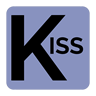

# KISS - ***Keep It Simple Starter***

Kit de inicio para desarrollo web en PHP, basado en el Principio de Diseño ***KISS***: *Mantén todo simple*.

Es un pequeño framework PHP para construir rápidamente aplicaciones web con el mínimo de configuración. Ideal para landing pages, sitios estáticos y dinámicos.

KISS es agnóstico de paradigmas de programación y orientado a componentes, además tiene soporte para conexiones a bases de datos MySQL mediante PDO y urls amigables con buen posicionamiento en SEO y redes sociales.

Adicionalmente puedes optimizar este kit con Node.js:

* Implementando un servidor proxy live reload con Browser Sync.
* Usar Sass para compilar CSS.
* Usar +ES6 y módulos para JS.
* Optimizar imágenes.
* Todo lo anterior automatizado con tareas Gulp.


## Cómo usarlo:

* Agrega tus páginas php en la carpeta `app/views`.
* El nombre del archivo sin la extensión .php será la URL amigable para esa página.
* Para el SEO de cada página crea un archivo con el nombre de la misma seguida de `_metas.php` y edita la información correspondiente.
* La aplicación requiere los archivos `home.php`, `home_metas.php`, `404.php` y `404_metas.php`, que están en la carpeta `app/views` así que no los renombres ni los borres, puedes cambiar su contenido.
* El archivo `app/helpers/router.php` no lo toques, ya que junto con el `.htaccess` principal hacen la magia de las URLs amigables.
* Edita el archivo `app/store/config.php` donde se encuentran los datos de configuración de la aplicación, así como la conexión a MySQL en caso de que exista.
* El archivo `app/store/db.php` tiene dos funciones para operaciones CRUD:
  * `db_search()` para búsquedas (operaciones `SELECT`) y
  * `db_affect()` para operaciones `INSERT`, `UPDATE` y `DELETE`.
* El archivo `app/components/html_header.php` contiene todo el código HTML necesario en el `<head>`, agrega y modifica todos los `<meta>` y `<link>` que necesites.
* El archivo `app/components/html_footer.php` contiene el cierre del documento HTML y la invocación del `<script>` principal de la aplicación, agrega y modifica todos los que necesites.
* En el archivo `app/app.php` encontrarás la estructura del template HTML de la aplicación, sienteté libre de adecuarla a tus necesidades y de requerir los archivos que necesites.
* Los archivos `logo.php`, `menu.php` y `navbar.php` de la carpeta `app/components`, así como los archivos `acerca.php`, `acerca_metas.php`, `contacto.php` y `contacto_meta.php` de la carpeta `app/views`, son meramente demostrativos para el demo que incluye el starter kit, puedes usarlos o borrarlos.
* Edita los archivos `humans.txt` y `sitemap.xml` a tus necesidades.
* Para convertir tu sitio o aplicación en PWA, considera:
  * Las dimensiones y nombres de las imágenes contenidas en la carpeta `img` para tu logo.
  * Edita la información del archivo `manifest.json`.
  * Edita la lista de los archivos que quieres cachear en el script `sw.js`.

## Cómo optimizarlo con Node.js:

* Requieres instalar Node.js en tu equipo de cómputo.
* Instala las dependencias listadas en el archivo `package.json` con el comando `npm install`.
* Edita las opciones del servidor proxy (ruta local y puerto) en el archivo `gulpfile.babel.js`.
* Comienza a trabajar con el comando `npm start`.
* En la carpeta `assets/scripts` encontrarás el archivo principal (`index.js`) para trabajar con módulos ES6. Toda la estructura interna propuesta en esta carpeta, es opcional, puedes modificar a tus necesidades.
* En la carpeta `assets/styles` encontrarás el archivo principal (`main.scss`) para trabajar con Sass. Toda la estructura interna propuesta en esta carpeta, es opcional, puedes modificar a tus necesidades.
* En la carpeta `assets/img` agrega todas las imágenes de tu sitio o aplicación, no importa que no esten optimizadas para la web ejecuta el comando `npm run images` y se comprimirán en la carpeta `img`.
* Cuando acabes tu aplicación o sitio, ejecuta el comando `npm run build` para generar las versiones finales de tus estilos y scripts.
* Si no deseas usar las opciones de optimización con Node.js, simplemente elimina la carpeta `assets` y los archivos: `package.json`, `package-lock.json`, `gulpfile.babel.js` y `.babelrc`.

### Licencia

```
Licencia MIT

Copyright (c) 2019 Jonathan MirCha <jonmircha@gmail.com>

Se concede permiso por la presente, libre de cargos, a cualquier persona que obtenga una copia de este software y de los archivos de documentación asociados (el "Software"), a utilizar el Software sin restricción, incluyendo sin limitación los derechos a usar, copiar, modificar, fusionar, publicar, distribuir, sublicenciar, y/o vender copias del Software, y a permitir a las personas a las que se les proporcione el Software a hacer lo mismo, sujeto a las siguientes condiciones:

El aviso de copyright anterior y este aviso de permiso se incluirán en todas las copias o partes sustanciales del Software.

EL SOFTWARE SE PROPORCIONA "COMO ESTÁ", SIN GARANTÍA DE NINGÚN TIPO, EXPRESA O IMPLÍCITA, INCLUYENDO PERO NO LIMITADO A GARANTÍAS DE COMERCIALIZACIÓN, IDONEIDAD PARA UN PROPÓSITO PARTICULAR E INCUMPLIMIENTO. EN NINGÚN CASO LOS AUTORES O PROPIETARIOS DE LOS DERECHOS DE AUTOR SERÁN RESPONSABLES DE NINGUNA RECLAMACIÓN, DAÑOS U OTRAS RESPONSABILIDADES, YA SEA EN UNA ACCIÓN DE CONTRATO, AGRAVIO O CUALQUIER OTRO MOTIVO, DERIVADAS DE, FUERA DE O EN CONEXIÓN CON EL SOFTWARE O SU USO U OTRO TIPO DE ACCIONES EN EL SOFTWARE.
```

[jonmircha](https://jonmircha.com)
